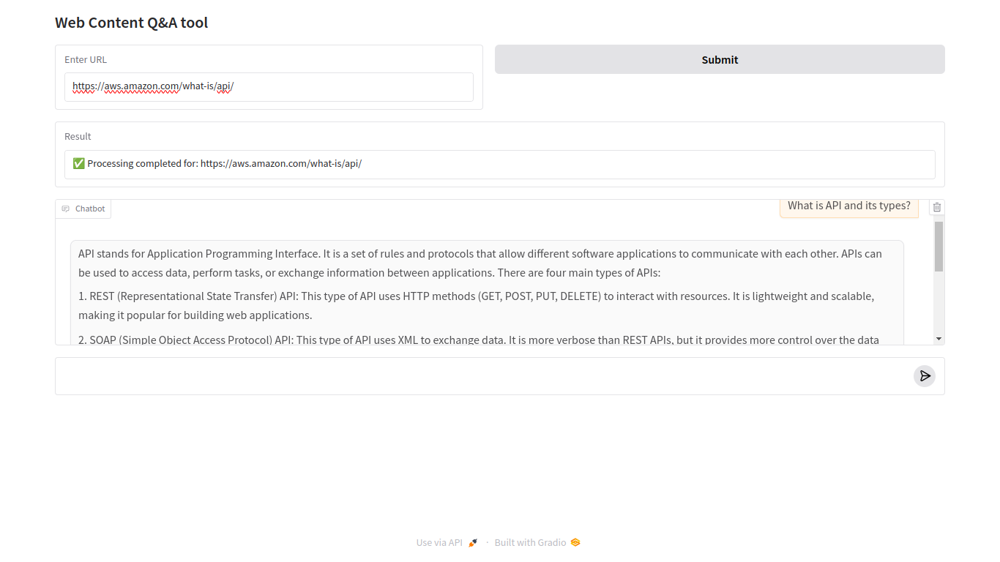
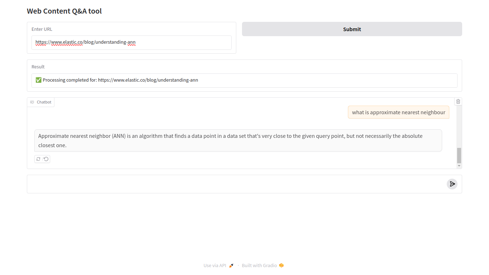

# Web-Content-RAG

Web-Content-RAG allows users to extract and query web page content using RAG (Retrieval-Augmented Generation).
Simply enter a URL, and the system will:
✅ Extract structured content from the webpage
✅ Split the text while preserving its structure
✅ Store the data in a FAISS vector database
✅ Retrieve relevant content using vector search
✅ Generate responses with MLC Qwen2.5-coder 3B

## Built with
1. Gradio for UI
2. MLC Qwen2.5-coder 3B LLM model
3. FAISS retriever for vector search
4. sentence-transformers/all-mpnet-base-v2 for embedding
5. Langchain HTMLSemanticPreservingSplitter for Document-structured based splitting 

## UI example and QnA in action!

